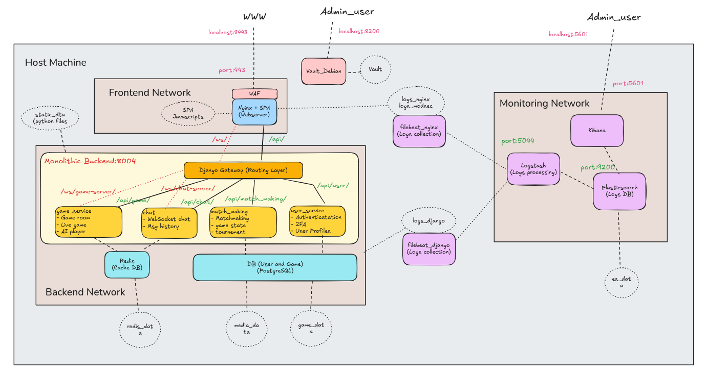

# ft_Transcendence
Developing a web game Pong from scratch


# Pong Game Project



## Quick Start 

### By Makefile
1. Clone the repo as above
```bash
git clone <repository-url>
cd ft_Transcendence
```
2. Use makefile
- To build run and check
```bash
make # It will create a copy of .env automatically, and do all the checks
```
- To build and run the program without checking
```bash
make go
```
- To remove stop and remvoe
```bash
make clean # It will delete the .env
```
- To rebuild and check
```bash
make re
```
3. Other usefull make commands
- To go inside a specific container using bash
```bash
make in ${service_name} # equals to do "docker exec -it ${service_name} bash"
```
- To simply run checks again
```bash
make check # In case you only change files that is run by cgi, you don't need to rebuild
```
- To deeply clean all the cached images in local host
```bash
make kill # It will kill every cached images even in ~/.docker/buildx
```

## Development Access Points

#### External
- Frontend (Nginx + WFA + SPA): http://localhost:8443
#### Internal access port
- Backend Service: 8004
- game_db: 5434
- user_db: 5432
- redis: 6379
- Vault UI: 8200
- Elasticsearch: 9200
- Logstash: 5044
- Kibana: 5601
- Prometheus: 9090
- Grafana: 3001

## Team Development Guidelines

### Auth Team
- Work in `auth-service/` directory
- Database migrations in `auth-service/src/migrations/`
- Access service at http://localhost:8001

### User Management Team
- Work in `user-service/` directory
- Database migrations in `user-service/src/migrations/`
- Access service at http://localhost:8002

### Game Team
- Work in `backend/` directory
- Database migrations in `backend/src/migrations/`
- Access service at http://localhost:8004

### Frontend Team
- Work in `frontend/` directory
- Access development server at http://localhost:3000

### Monitoring Team
- Configure Prometheus in `monitoring/prometheus/`
- Set up Grafana dashboards in `monitoring/grafana/`
- Configure ELK stack in `monitoring/elk/`

### Notes

1. To clear everything in docker ```docker stop $(docker ps -qa); docker rm $(docker ps -qa); docker rmi -f $(docker images -qa); docker volume rm $(docker volume ls -q); docker network rm $(docker network ls -q) 2>/dev/null```


2. To test XXS and see WAF audit log, do ```curl -k "https://localhost:8443/test-waf?input=<script>alert(1)</script>"```
