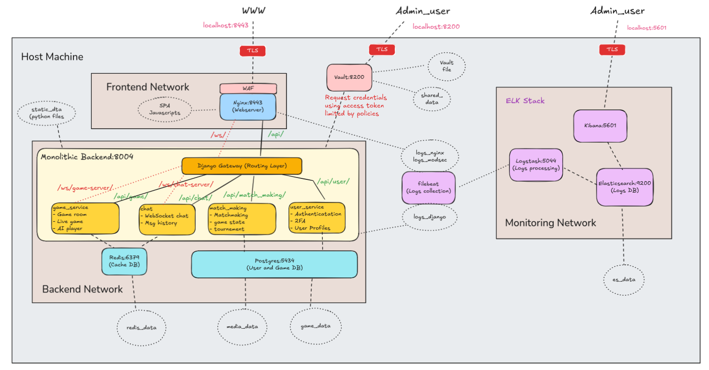
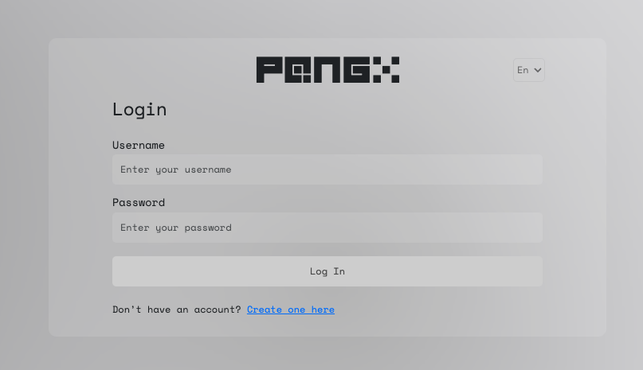
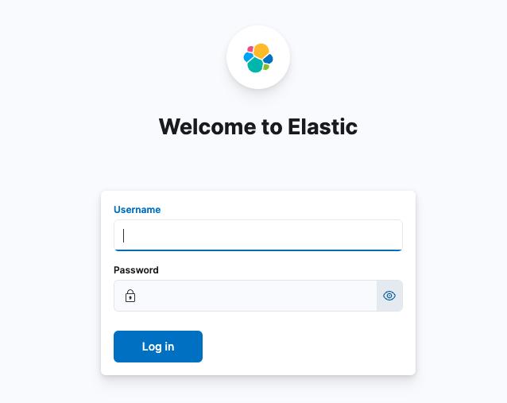
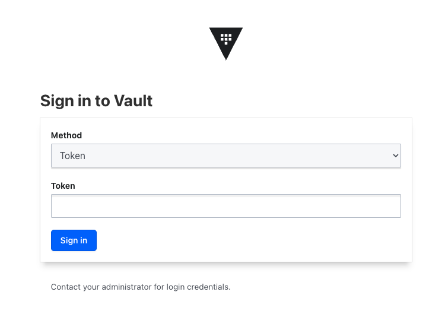

# ft_Transcendence

## Project Objectives
Developing a web game Pong from scratch including the following features:
1. Had basic user management systems for users to register, 2FA validate id, customize user settings.
2. Utilised Websocket to allow users to do live chat with other users and play games remotely.
3. Supported different game modes like remote PVP, local PVP, single player vs computer(AI).
4. Adopted Single page Access (SPA) for better UX in the frontend.
5. Implemented WAF firewall ahead of Nginx to prevent malicious requests. Used Vault to store sensitive credentials like admin user keys.
6. Pre-scripted ELK stack deployment in a isolated docker environment, including necessary TLS, SSL settings and logs lifetime management policies.
7. Added automated unit tests at launch time to check key feature healthiness.


## Pong Game Project System Diagram



## Quick Start 

### By Makefile
1. Clone the repo as above
```bash
git clone <repository-url>
cd ft_Transcendence
```
2. Use makefile
- To build run and check
```bash
make # It will create a copy of .env automatically, and do all the checks
```
- To build and run the program without checking
```bash
make go
```
- To remove stop and remvoe
```bash
make clean # It will delete the .env
```
- To rebuild and check
```bash
make re
```
3. Other usefull make commands
- To go inside a specific container using bash
```bash
make in ${service_name} # equals to do "docker exec -it ${service_name} bash"
```
- To simply run checks again
```bash
make check # In case you only change files that is run by cgi, you don't need to rebuild
```
- To deeply clean all the cached images in local host
```bash
make kill # It will kill every cached images even in ~/.docker/buildx
```

## Development Access Points

#### External
- Frontend (Nginx + WFA + SPA): https://localhost:8443

- ELK Stack (Kibana UI): https://localhost:5601

- Security (Vault UI): https://localhost:8200

#### Internal access port
- Backend (django and its services): 8004 (api), 8001 (ws)
- Postgres DB: 5434
- redis: 6379
- Elasticsearch: 9200
- Logstash: 5044
- Prometheus: 9090
- Grafana: 3001

## Team Development Guidelines

### Backend (Game + User Management) Team
- Work in `backend/` directory
- Access service at http://localhost:8004 for API request and 8001 for WS

### Frontend Team
- Work in `frontend/` directory
- Access development server at https://localhost:8443

### Monitoring Team
- Work in `monitoring/` directory
- Configure Prometheus in `monitoring/prometheus/`
- Set up Grafana dashboards in `monitoring/grafana/`
- Configure ELK stack in `monitoring/elk/`

### Security Team
- Work in `security/` directory

### tests
- Put all the unit test scripts in `tests/` directory

### Notes

1. To clear everything in docker ```docker stop $(docker ps -qa); docker rm $(docker ps -qa); docker rmi -f $(docker images -qa); docker volume rm $(docker volume ls -q); docker network rm $(docker network ls -q) 2>/dev/null```


2. To test XXS and see WAF audit log, do ```curl -k "https://localhost:8443/test-waf?input=<script>alert(1)</script>"```
