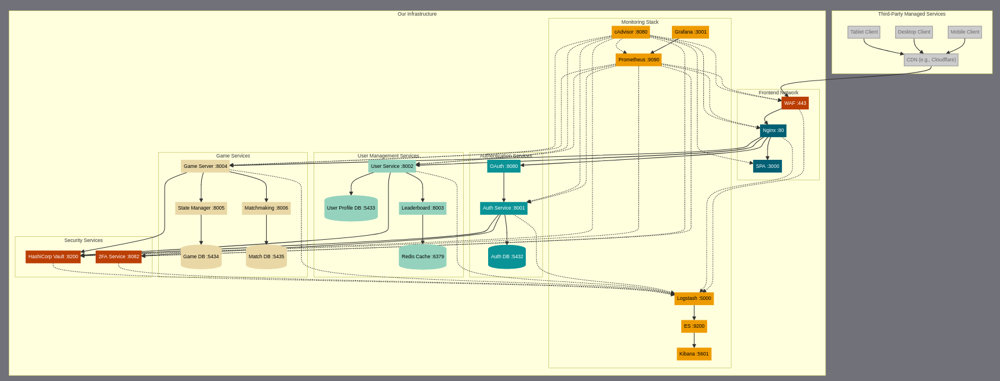

# ft_Transcendence
Developing a web game Pong from scratch


# Pong Game Project



## Quick Start 

### Manually 
1. Clone the repository
```bash
git clone <repository-url>
cd ft_Transcendence/pong-game
```

2. Set up environment
```bash
cp .env.example .env
# Edit .env with appropriate values
```

3. Start services
```bash
docker-compose up -d
```

### By Makefile
1. Clone the repo as above
```bash
git clone <repository-url>
cd ft_Transcendence
```
2. Use makefile
```bash
make #It will create a copy of .env
```
3. To remove stop and remvoe
```bash
make clean #It will delete the .env
```

## Development Access Points

- Frontend (SPA): http://localhost
- Auth Service: http://localhost:8001
- User Service: http://localhost:8002
- Game Service: http://localhost:8004
- Vault UI: http://localhost:8200
- Grafana: http://localhost:3001
- Kibana: http://localhost:5601
- Prometheus: http://localhost:9090

## Team Development Guidelines

### Auth Team
- Work in `auth-service/` directory
- Database migrations in `auth-service/src/migrations/`
- Access service at http://localhost:8001

### User Management Team
- Work in `user-service/` directory
- Database migrations in `user-service/src/migrations/`
- Access service at http://localhost:8002

### Game Team
- Work in `game-service/` directory
- Database migrations in `game-service/src/migrations/`
- Access service at http://localhost:8004

### Frontend Team
- Work in `frontend/` directory
- Access development server at http://localhost:3000

### Monitoring Team
- Configure Prometheus in `monitoring/prometheus/`
- Set up Grafana dashboards in `monitoring/grafana/`
- Configure ELK stack in `monitoring/elk/`

### Notes

1. To clear everything in docker ```docker stop $(docker ps -qa); docker rm $(docker ps -qa); docker rmi -f $(docker images -qa); docker volume rm $(docker volume ls -q); docker network rm $(docker network ls -q) 2>/dev/null```


2. To test XXS and see WAF audit log, do ```curl -k "https://localhost:8443/test-waf?input=<script>alert(1)</script>"```